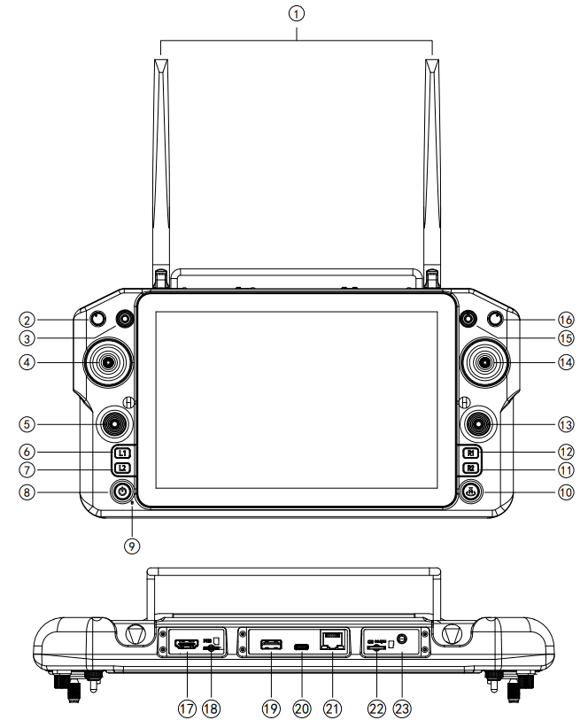

# 云卓 Demo 简介:

- 1.RCSDKDemo: [遥控器SDK及Demo(推荐)](https://gitee.com/skydroid/rcsdk-demo)
- 2.SkydroidFpvTest: [适用于T10，T12，H12，H30串口连接方式 ](https://gitee.com/skydroid/SkydroidFpvTest)
- 3.SkydroidH12Demo: [H12数传图传SDKDemo(旧版,不推荐,后续不再维护)](https://gitee.com/skydroid/SkydroidH12Demo)
- 4.SkydroidDemo: [H16及H30安卓开发示例](https://gitee.com/skydroid/SkydroidDemo)
- 5.FPVPlayerDemo: [云卓图传播放器Demo](https://gitee.com/skydroid/fpv-player-demo)


|      Demo     |            RCSDK             |    SkydroidFpvTest    | SkydroidH12Demo<br>旧版  |       SkydroidDemo      | FPV-Player<br>网口 图传 |
|     :----:    |            :----:            |        :----:          |        :----:          |         :----:          |         :----:             |
|     适用于     |H12、H12Pro、H16<br>后续会新增H30|    T10、T12、H12、H30   |       T10、T12、H12    |        H16、H30          |     H12Pro、H16、H30       |
|  T10，T12图传  |               ✘              |       ✔<br>USB 图传    |       ✔<br>USB 图传    |            ✘            |         ✘        |
|     H12数传    |               ✔              |          ✔            |          ✔            |            ✘            |         ✘        |
|     H12图传    |               ✘              |     ✔<br>串口 图传      |     ✔<br>串口 图传     |            ✘            |         ✘        |
|  H12Pro数传    |               ✔              |          ✘            |          ✘            |            ✘            |         ✘        |
|  H12Pro图传    |               ✘              |          ✘            |          ✘            |            ✘            |         ✔        |
|     H16数传    |               ✔              |          ✘            |          ✘            |      ✔<br>舵量、手型      |         ✘        |
|     H16图传    |               ✘              |          ✘            |          ✘            |      ✔<br>网口 图传       |         ✔        |
|     H30数传    |               ✔              |          ✔            |          ✘            |      ✔<br>舵量、手型、信号  |         ✘        |
|     H30图传    |               ✘              |          ✘            |          ✘            |      ✔<br>网口 图传       |         ✔        |
|     遥控调参    |        ✔<br>支持助手功能       |          ✘            |          ✘            |            ✘            |         ✘        |
|     云台控制    |               ✘              |          ✔            |          ✘            |            ✘            |         ✔        |


---

# T10，T12，H12，H30 安卓开发示例

1.本demo适用于T10，T12，H12，H30串口连接方式  
2.目前支持一下功能:
- &#9745; T10，T12 USB 图传显示;
- &#9745; H12 与飞控通讯的接口;
- &#9745; H12 串口图传显示;
- &#9745; H30 数传;


---

## 一、T10_T12通讯方式(2020.10.19版)

### 1.T12遥控器的组成


|  序号   | 注解  | 
|  ----  | ----  |
| 1  | 2.4G 3dB天线 |
| 7  | 电源开关 | 
| 8  | USB1/图像输出 |
| 10 | USB2/充电/数据传输 |

### 2.接收机状态指示灯

|  状态指示灯   | 接收机状态  | 
|  ----  | ----  |
| 绿灯长亮  | 通讯正常 |
| 绿灯慢闪  | 与遥控断连 | 
| 绿灯快闪  | 对频模式 |
| 红灯长亮 | C.BUS模式 |
| 红灯慢闪  | 升级中 |
| 红灯快闪 | 自检没过，请重试或返厂 |

### 3.T12遥控器的连接方式
使用配套的*T10/T12 Type-c otg线* 连接手机


### 4.T10_T12调用示例代码

图传：usb串口连接方式 

[详见 UsbSerialActivity](app/src/main/java/com/skydroid/fpvtest/UsbSerialActivity.java)

---

## 二、H12通讯方式(2020.10.21版)

### 1.h12遥控器的组成


|  序号   | 注解  | 
|  ----  | ----  |
| 1  | 2.4G 3dB天线 |
| 9  | 电源按键 | 
| 17 | 充电口 |
| 18 | PPM输出 |

### 2.使用串口线共享数传(详情请见说明书)

- 以H12连接Mission Planner为例
- 一头插H12遥控器音频口，一头与电脑相连
- 打开Mission Planner地面站，选择对应COM口 ，即可连接。


### 3.遥控器有2路串口

|  串口   | 地址  | 波特率  | 用途  |
|  ----  | ----  | ----  | ----  |
| uart0  | /dev/ttyHS0 | 4000000 | 图传 |
| uart1  | /dev/ttyHS1 | 921600 | 数传 |

### 4.在H12助手可以查看接收机数传波特率

- 代码里串口1的波特率 = 921600(固定的);
- 接收机波特率要和要与飞控同步，飞控的波特率=接收机的波特率;
- 飞控如果是115200，接收机波特率也要设置115200;
- 当数传不能收到数据或数据不正确时,请检查这三处波特率设置是否正确;


### 5.数传串口调用示例代码(串口1)
[详见 H12DataSamplesActivity](app/src/main/java/com/skydroid/fpvtest/H12DataSamplesActivity.java)

- 5.1. 创建数传连接
```
        mServiceConnection = SerialPortConnection.newBuilder("/dev/ttyHS1",921600)
                .flags(1 << 13)
                .build();
       mServiceConnection.openConnection();//打开串口
```
- 5.2. 读取数据
**通过监听读取串口数据**
```
        mServiceConnection.setDelegate(new SerialPortConnection.Delegate() {
            @Override
            public void received(byte[] bytes, int size) {
                Log.e("received",new String(bytes));
            }

            @Override
            public void connect() {

            }
        });
```

- 5.3. 发送数据

```
    mServiceConnection.sendData("".getBytes());
```

- 5.4. 关闭连接
```
    mServiceConnection.closeConnection();
```

### 6.图传串口调用示例代码(串口0)

[详见 H12VideoSamplesActivity](app/src/main/java/com/skydroid/fpvtest/H12VideoSamplesActivity.java)


- 6.1. 创建图传连接
```
        mSerialPortConnection = SerialPortConnection.newBuilder("/dev/ttyHS0",4000000)
                .flags(1 << 13)
                .build();
```

- 6.2. 读取数据
**通过监听读取串口数据,并将视频流展示在UI上**
```
     mSerialPortConnection.setDelegate(new SerialPortConnection.Delegate() {
            @Override
            public void received(byte[] bytes, int size) {
                if(mFPVVideoClient != null){
                    mFPVVideoClient.received(bytes,size);
                }
            }

            @Override
            public void connect() {
                if(mFPVVideoClient != null){
                    mFPVVideoClient.startPlayback();
                }
            }
        });
```
```
     mFPVVideoClient.setDelegate(new FPVVideoClient.Delegate() {
            //视频相关
            @Override
            public void renderI420(byte[] frame, int width, int height) {
                if (!isSetTime && mSerialPortControl!= null){
                    isSetTime = true;
                    //设置相机时间
                    mSerialPortControl.setTime(System.currentTimeMillis());
                }
                mPreviewDualVideoView.renderI420(frame,width,height);
            }
        });
```

- 6.3. 控制云台

```
    mFPVVideoClient.startRecord(null,null);//开始录像
    mFPVVideoClient.stopRecord();//结束录像
    mFPVVideoClient.captureSnapshot(null,null);//拍照
    mSerialPortControl.AkeyControl(PTZAction.DOWN);//一键向下
    mSerialPortControl.switchCamera();// 切换摄像头
    mSerialPortControl.toggleLED();// 开关LED
    mSerialPortControl.flip(flip);// 翻转
```

- 6.4. 关闭连接
```
    mSerialPortConnection.closeConnection();
    mFPVVideoClient.stopPlayback();
```

---

## 三、H30通讯方式(2022.09.06版)

### 1.h30遥控器的组成



|  序号   | 注解  | 
|  ----  | ----  |
| 1  | 800M/1.4G/2.4G三种天线 |
| 8  | 电源键 | 
| 19 | USB 接口 |
| 20 | TYPE-C 接口 |
| 21 | RJ45 网口接口 |
| 23 | PPM 接口 |


### 2.遥控器的串口

获取遥控器相关数据

- 与遥控器通讯采用硬件串口交互方式。数据传输私有协议，详情请见协议文档

|  串口   | 地址  | 波特率  | 用途  |
|  ----  | ----  | ----  | ----  |
| uart1  | /dev/ttyMSM1 | 57600 | 数传 |

- H30的天空端数传接口以及信号强度的获取方法，详情请见 [SkydroidDemo](https://gitee.com/skydroid/SkydroidDemo)

- H30的网口图传的获取方法，详情请见 [FPV-Player-Demo](https://gitee.com/skydroid/fpv-player-demo)

### 3.数传串口调用示例代码(串口1)

[详见 H30DataSamplesActivity](app/src/main/java/com/skydroid/fpvtest/H30DataSamplesActivity.java)

---

## 四、更多H16、H30相关用例(2022.11.15版)

[详见 SkydroidDemo](https://gitee.com/skydroid/SkydroidDemo)

---

## 五、H12旧版的相关用例(2020.09.26版,用于参考)

[详见 SkydroidH12Demo](https://gitee.com/skydroid/SkydroidH12Demo)

---

## 六、H12、H12Pro、H16的相关用例(20230713版,推荐版本)

- 云卓遥控器RCSDK-Demo
- 适用于 H12、H12Pro、H16等遥控器的数传 集成;
- 主要功能的遥控器数传和调参（获取SN、获取按键通道值，设置/设置摇杆模式等等助手APP涉及到的大部分功能，也集成了飞控通讯的接口）;
- [详见 RCSDK-Demo](https://gitee.com/skydroid/rcsdk-demo)

---

## 七、网口图传的相关用例(20230703版)

- 云卓图传播放器Demo
- 适用于 H16、H16Pro、H12Pro、H20、H30等支持网口摄像头的遥控器;
- [详见 FPV-Player-Demo](https://gitee.com/skydroid/fpv-player-demo)
